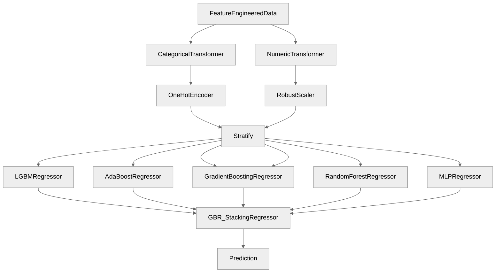

# **2011 TOUR Championship**
*Author: Declan Costello*

<!-- TABLE OF CONTENTS -->

  
Table of Contents

  <ol>
    <li><a href="#Overview">Overview</a></li>
    <li><a href="#EDA">EDA</a></li>
    <li><a href="#SG-per-Round">SG per Round</a></li>
    <li><a href="#SG-per-Hole-per-Round">SG per Hole per Roun</a></li>
    <li><a href="#SG-vs-Driving-Distance-and-Accuracy">SG vs Driving Distance and Accuracy</a></li>
    <li><a href="#Distance-to-Pin-vs-Strokes-to-Hole-Out">Distance to Pin vs Strokes to Hole Out</a></li>
    <li><a href="#Bayes">Bayes</a></li>
    <li><a href="#Roadmap">Roadmap</a></li>
  </ol>

## **Overview**

Welcome to my analysis of the **2011 TOUR Championship** at [East Lake Golf Club!](https://www.eastlakegolfclub.com/course/) With an interest in sports analytics, the primary aspiration is to contribute meaningful insights to the golf community. To get a better feel for the visual details, I encourage you to check out the interactive visuals on  [NBViewer!](https://nbviewer.org/github/dec1costello/Golf/tree/main/TOUR_Championship_2011/)

## [EDA](https://nbviewer.org/github/dec1costello/Golf/blob/main/TOUR_Championship_2011/EDA.ipynb)

In Part 1, I explore the data and start to feature engineer to help understand, clean, and refine the dataset. It guides model choice and assumption validation, while also revealing insights through visualization. By addressing data quality and understanding patterns early, here I establish a strong foundation for the rest of my project.

<table>

<tbody>
  <tr>
    <td>
      
    </td>
</tr>
</tbody>
</table>

(<a href="#readme-top">back to top</a>)

## [SG per Round](https://nbviewer.org/github/dec1costello/Golf/blob/main/TOUR_Championship_2011/StrokesGainedPerRound.ipynb)

In Part 2, I explore the distribution of Strokes Gained for each round of the Championship. Round 3 seemed to be the most chaotic, as there was a significant variance in player performance throughout the day.

<table>

<tbody>
  <tr>
    <td>
      
    </td>
</tr>
</tbody>
</table>

(<a href="#readme-top">back to top</a>)

## [SG per Hole per Round](https://nbviewer.org/github/dec1costello/Golf/blob/main/TOUR_Championship_2011/ImprovedStrokesGainedPerRoundPerHole.ipynb)

In Part 3, I explore the distribution of Strokes Gained for each hole of each round of the Championship.

<table>

<tbody>
  <tr>
    <td>
      
    </td>
</tr>
</tbody>
</table>

(<a href="#readme-top">back to top</a>)

## [SG vs Driving Distance and Accuracy](https://nbviewer.org/github/dec1costello/Golf/blob/main/TOUR_Championship_2011/DGvsCG.ipynb)

In Part 4, I explore the distribution of Strokes Gained vs Driving Distance & Accuracy for each hole of each round of the Championship. Happy to say my analysis aligns with [Data Golf's Course Fit Tool](https://datagolf.com/course-fit-tool) for East Lake Golf Club.

<table>

<tbody>
  <tr>
    <td>
      
    </td>
</tr>
</tbody>
</table>

(<a href="#readme-top">back to top</a>)

## [Distance to Pin vs Strokes to Hole Out](https://nbviewer.org/github/dec1costello/Golf/blob/main/TOUR_Championship_2011/xSG.ipynb)

In Part 5, I explore the relationship between Distance to the Pin & Lie vs Strokes to hole out at the Tour Championship. I Ensemble the top  preforming models together using a [Stack](https://scikit-learn.org/stable/modules/generated/sklearn.ensemble.StackingRegressor.html) to minimize [Bias](https://towardsdatascience.com/a-quickstart-guide-to-uprooting-model-bias-f4465c8e84bc) and [Variance](https://x.com/akshay_pachaar/status/1703757251474063861?s=20). This iterative process maximized predictive accuracy of Expected Strokes Gained(xSG)

  

(<a href="#readme-top">back to top</a>)

<!-- ROADMAP -->
## Roadmap

- [x] Make xSG Stack Model
    - [ ] Divide into Putting, Around, Approach, and Off the Tee (200-500) individual models
    - [ ] Mock [Datagolf](https://datagolf.com/approach-skill)
- [ ] Make Bayes Model for est distance to pin after shot
- [ ] Make into Streamlit App
- [ ] Plottable
    - [ ] Redo Driving Fairway %
    - [ ] Holes
    - [ ] Players, include Greens in Reg %

(<a href="#readme-top">back to top</a>)

