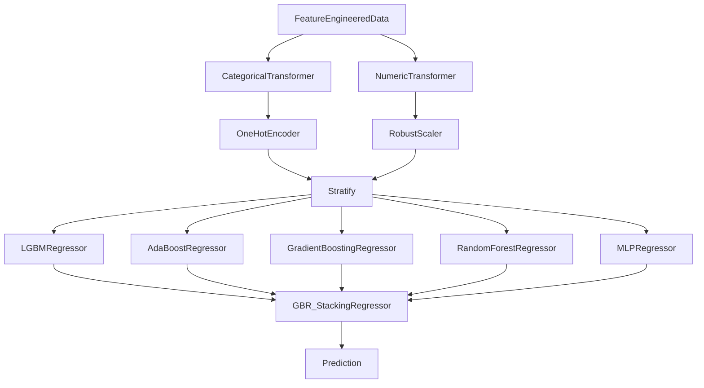

# **2011 TOUR Championship**
*Author: Declan Costello*

<!-- TABLE OF CONTENTS -->

  
Table of Contents

  <ol>
    <li><a href="#Overview">Overview</a></li>
    <li><a href="#EDA">EDA</a></li>
    <li><a href="#SG-per-Round">SG per Round</a></li>
    <li><a href="#SG-per-Hole">SG per Hole</a></li>
    <li><a href="#SG-per-Drive">SG per Drive</a></li>
    <li><a href="#Expected-Strokes-Model">Expected Strokes Model</a></li>
    <li><a href="#SG-per-Player">SG per Player</a></li>
    <li><a href="#SG-per-Location">SG per Location</a></li>
    <li><a href="#Roadmap">Roadmap</a></li>
  </ol>

## **Overview**

Welcome to my analysis of the **2011 TOUR Championship** at [East Lake Golf Club!](https://www.eastlakegolfclub.com/course/) With an interest in sports analytics, the primary aspiration is to contribute meaningful insights to the golf community. To get a better feel for the visual details, I encourage you to check out the interactive visuals on  [NBViewer!](https://nbviewer.org/github/dec1costello/Golf/tree/main/TOUR_Championship_2011/)

## [EDA](https://nbviewer.org/github/dec1costello/Golf/blob/main/TOUR_Championship_2011/EDA.ipynb)

In Part 1, I explore the data and start to feature engineer to help understand, clean, and refine the dataset. It guides model choice and assumption validation, while also revealing insights through visualization. By addressing data quality and understanding patterns early, here I establish a strong foundation for the rest of my project.

## [SG per Round](https://nbviewer.org/github/dec1costello/Golf/blob/main/TOUR_Championship_2011/StrokesGainedPerRound.ipynb)

In Part 2, I explore the distribution of Strokes Gained for each round of the Championship. Round 3 seemed to be the most chaotic, as there was a significant variance in player performance throughout the day.

  

(<a href="#readme-top">back to top</a>)

## [SG per Hole](https://nbviewer.org/github/dec1costello/Golf/blob/main/TOUR_Championship_2011/ImprovedStrokesGainedPerRoundPerHole.ipynb)

In Part 3, I explore the distribution of Strokes Gained for each hole of each round of the Championship.

  

(<a href="#readme-top">back to top</a>)

## [SG per Drive](https://nbviewer.org/github/dec1costello/Golf/blob/main/TOUR_Championship_2011/DGvsCG.ipynb)

In Part 4, I explore the distribution of Strokes Gained vs Driving Distance Gained (DG) and Driving Accuracy Gained (AG) for each drive of the Championship. Happy to say my analysis aligns with [Data Golf's Course Fit Tool](https://datagolf.com/course-fit-tool), in that AG appears to be an important facor for preforming at East Lake Golf Club.

  

(<a href="#readme-top">back to top</a>)

## [Expected Strokes Model](https://nbviewer.org/github/dec1costello/Golf/blob/main/TOUR_Championship_2011/xSG.ipynb)

In Part 5, I explore the relationship between Distance to the Pin & Lie vs Strokes to hole out at the Tour Championship. I Ensemble the top  preforming models together using a [Stack](https://scikit-learn.org/stable/modules/generated/sklearn.ensemble.StackingRegressor.html) to minimize [Bias](https://towardsdatascience.com/a-quickstart-guide-to-uprooting-model-bias-f4465c8e84bc) and [Variance](https://x.com/akshay_pachaar/status/1703757251474063861?s=20). This iterative process maximized predictive accuracy of Expected Strokes(xS)

(<a href="#readme-top">back to top</a>)

## [xS Model Preformance](https://nbviewer.org/github/dec1costello/Golf/blob/main/TOUR_Championship_2011/DGvsCG.ipynb)

In Here I look at the model's preformance

  

(<a href="#readme-top">back to top</a>)

<!-- ROADMAP -->
## Roadmap

- [x] xS Stack Model Refinement
    - [ ] Create seperate putting model
    - [ ] MLFlow
        - [ ] [Refer To](https://medium.com/infer-qwak/building-an-end-to-end-mlops-pipeline-with-open-source-tools-d8bacbf4184f)
        - [ ] [Watch](https://www.youtube.com/watch?v=-7XegzgjgM0&list=PLQqR_3C2fhUUkoXAcomOxcvfPwRn90U-g&index=8)
        - [ ] [Utilize](https://community.cloud.databricks.com/?o=5379878152283690)  
    - [ ] Drift Detection
        - [ ] [Evidently](https://www.youtube.com/watch?v=L4Pv6ExBQPM)
        - [ ] [Whylogs](https://github.com/whylabs/whylogs)
- [ ] Add External Data
    - [ ] [Career Earnings](https://www.spotrac.com/pga/rankings/date/2011-01-01/2011-09-20/)
    - [ ] Biometrics
    - [ ] [Weather](https://www.wunderground.com/history/daily/KATL/date/2011-9-22)
- [ ] Data Viz
    - [ ] [SG Distributions](https://baseballsavant.mlb.com/visuals/statcast-pitch-distribution)
    - [ ] [Hole Heatmaps](https://datagolf.com/hole-heatmaps)
    - [ ] [Lie & SG Plinko](https://baseballsavant.mlb.com/visuals/pitch-plinko)
    - [ ] [Drive KDE](https://baseballsavant.mlb.com/player-comparison)
- [ ] Bayesian Integration
    - [ ] [Refer To](https://colab.research.google.com/github/AllenDowney/ThinkBayes2/blob/master/examples/hockey.ipynb#scrollTo=B-c6bb9wO-Cs)
    - [ ] [Watch](https://www.youtube.com/watch?v=Zi6N3GLUJmw)
    - [ ] [Utilize](https://colab.research.google.com/github/AllenDowney/ThinkBayes2/)

(<a href="#readme-top">back to top</a>)

