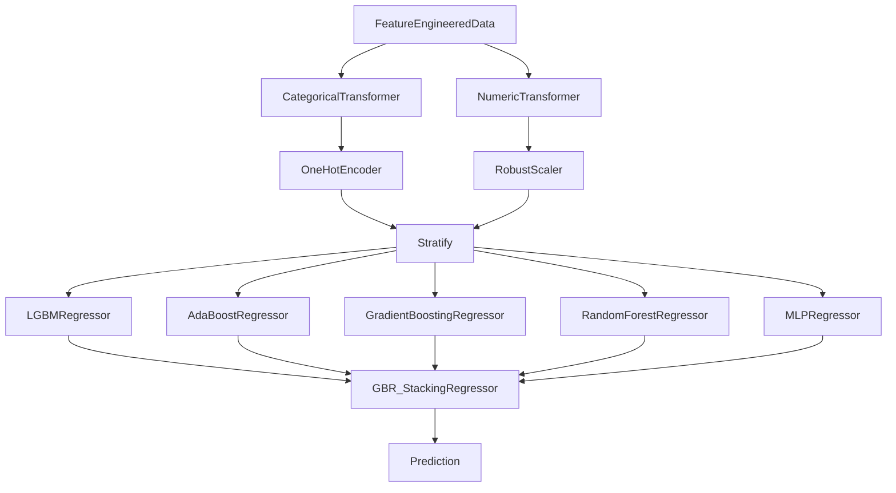

# **2011 TOUR Championship**
*Author: Declan Costello*

<!-- TABLE OF CONTENTS -->

  
Table of Contents

  <ol>
    <li><a href="#Overview">Overview</a></li>
    <li><a href="#EDA">EDA</a></li>
    <li><a href="#SG-per-Round">SG per Round</a></li>
    <li><a href="#SG-per-Hole-per-Round">SG per Hole per Round</a></li>
    <li><a href="#SG-vs-Driving-Distance-and-Accuracy">SG vs Driving Distance and Accuracy</a></li>
    <li><a href="#Distance-to-Pin-vs-Strokes-to-Hole-Out">Distance to Pin vs Strokes to Hole Out</a></li>
    <li><a href="#Bayes">Bayes</a></li>
    <li><a href="#Roadmap">Roadmap</a></li>
  </ol>

## **Overview**

Welcome to my analysis of the **2011 TOUR Championship** at [East Lake Golf Club!](https://www.eastlakegolfclub.com/course/) With an interest in sports analytics, the primary aspiration is to contribute meaningful insights to the golf community. To get a better feel for the visual details, I encourage you to check out the interactive visuals on  [NBViewer!](https://nbviewer.org/github/dec1costello/Golf/tree/main/TOUR_Championship_2011/)

## [EDA](https://nbviewer.org/github/dec1costello/Golf/blob/main/TOUR_Championship_2011/EDA.ipynb)

In Part 1, I explore the data and start to feature engineer to help understand, clean, and refine the dataset. It guides model choice and assumption validation, while also revealing insights through visualization. By addressing data quality and understanding patterns early, here I establish a strong foundation for the rest of my project.

## [SG per Round](https://nbviewer.org/github/dec1costello/Golf/blob/main/TOUR_Championship_2011/StrokesGainedPerRound.ipynb)

In Part 2, I explore the distribution of Strokes Gained for each round of the Championship. Round 3 seemed to be the most chaotic, as there was a significant variance in player performance throughout the day.

<table>

<tbody>
  <tr>
    <td>
      
    </td>
</tr>
</tbody>
</table>

(<a href="#readme-top">back to top</a>)

## [SG per Hole per Round](https://nbviewer.org/github/dec1costello/Golf/blob/main/TOUR_Championship_2011/ImprovedStrokesGainedPerRoundPerHole.ipynb)

In Part 3, I explore the distribution of Strokes Gained for each hole of each round of the Championship.

<table>

<tbody>
  <tr>
    <td>
      
    </td>
</tr>
</tbody>
</table>

(<a href="#readme-top">back to top</a>)

## [SG vs Driving Distance and Accuracy](https://nbviewer.org/github/dec1costello/Golf/blob/main/TOUR_Championship_2011/DGvsCG.ipynb)

In Part 4, I explore the distribution of Strokes Gained vs Driving Distance Gained (DG) and Accuracy Gained (AG) for each player for each hole of each round fot the Championship. Happy to say my analysis aligns with [Data Golf's Course Fit Tool](https://datagolf.com/course-fit-tool), in that AG appears to be an important facor for preforming at East Lake Golf Club.

<table>

<tbody>
  <tr>
    <td>
      
    </td>
</tr>
</tbody>
</table>

(<a href="#readme-top">back to top</a>)

## [Distance to Pin vs Strokes to Hole Out](https://nbviewer.org/github/dec1costello/Golf/blob/main/TOUR_Championship_2011/xSG.ipynb)

In Part 5, I explore the relationship between Distance to the Pin & Lie vs Strokes to hole out at the Tour Championship. I Ensemble the top  preforming models together using a [Stack](https://scikit-learn.org/stable/modules/generated/sklearn.ensemble.StackingRegressor.html) to minimize [Bias](https://towardsdatascience.com/a-quickstart-guide-to-uprooting-model-bias-f4465c8e84bc) and [Variance](https://x.com/akshay_pachaar/status/1703757251474063861?s=20). This iterative process maximized predictive accuracy of Expected Strokes Gained(xSG)

  

(<a href="#readme-top">back to top</a>)

<!-- ROADMAP -->
## Roadmap

- [x] xS Stack Model Refinement
    - [ ] Create seperate putting model
    - [ ] [MLFlow Integration](https://mlflow.org/docs/latest/traditional-ml/hyperparameter-tuning-with-child-runs/notebooks/hyperparameter-tuning-with-child-runs.html)
        - [ ] [Refer To](https://medium.com/infer-qwak/building-an-end-to-end-mlops-pipeline-with-open-source-tools-d8bacbf4184f)
        - [ ] [Utilize](https://community.cloud.databricks.com/?o=5379878152283690)
        - [ ] [Watch](https://www.youtube.com/watch?v=-7XegzgjgM0&list=PLQqR_3C2fhUUkoXAcomOxcvfPwRn90U-g&index=8)
- [ ] [Bayesian Integration](https://www.pymc.io/projects/examples/en/latest/gallery.html)
    - [ ] [Refer To](https://colab.research.google.com/github/AllenDowney/ThinkBayes2/blob/master/examples/hockey.ipynb#scrollTo=B-c6bb9wO-Cs)
    - [ ] [Utilize](https://colab.research.google.com/github/AllenDowney/ThinkBayes2/)
    - [ ] [Watch](https://www.youtube.com/watch?v=Zi6N3GLUJmw)
- [ ] Drift Detection Integration
    - [ ] [Evidently](https://www.youtube.com/watch?v=L4Pv6ExBQPM)
    - [ ] [Whylogs](https://github.com/whylabs/whylogs)
- [ ] Golf Domain Questions
    - [ ] Approach shot always #2 on par 4s? what if someone drives the green?
    - [ ] Vice versa, If a golfer hits the green on a par 3, does that contribute to fairways hit %?
    - [ ] Predicted SG with same data from that round? or against standard?
- [ ] External Data Integration
    - [ ] [Career Earnings](https://www.spotrac.com/pga/rankings/date/2011-01-01/2011-09-20/)
    - [ ] [Weather](https://www.wunderground.com/history/daily/KATL/date/2011-9-22)
- [ ] Random
    - [ ] Count flow type charts w/ Lies before adn After
    - [ ] actual sg per player
    - [ ] get water data holes in project
    - [ ] Map Data
        - [ ] expected on course per hole
        - [ ] acutall mappings with sg colored per hole
        - [ ] map holes with convex hulls

(<a href="#readme-top">back to top</a>)

