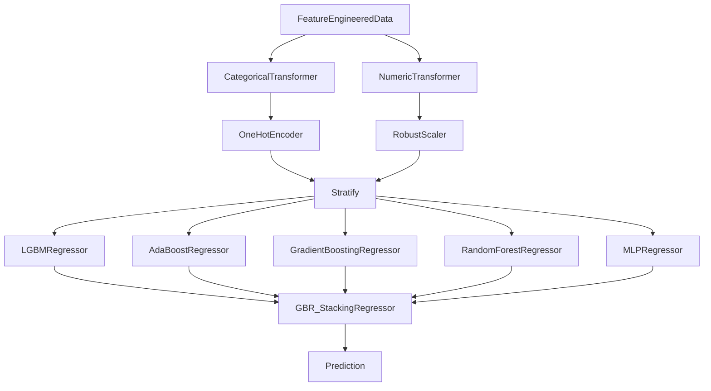

# **2011 TOUR Championship**
*Author: Declan Costello*

<!-- TABLE OF CONTENTS -->

  
Table of Contents

  <ol>
    <li><a href="#Objectives">Objectives</a></li>
    <li><a href="#Dataset">Dataset</a></li>
    <li><a href="#EDA">EDA</a></li>
    <ol>
    <li><a href="#SG-per-Round">SG per Round</a></li>
    <li><a href="#SG-per-Hole">SG per Hole</a></li>
    <li><a href="#SG-per-Drive">SG per Drive</a></li>
    </ol>
    <li><a href="#Expected-Strokes-Model">Expected Strokes Model</a></li>
    <ol>
    <li><a href="#Model-Selection">xS Model Selection</a></li>
    <li><a href="#Model-Explainability">xS Model Explainability</a></li>
    <li><a href="#Model-Arch">xS Model Arch</a></li>
    <li><a href="#Model-Preformance">xS Model Preformance</a></li>
    </ol>
    <li><a href="#SG-per-Shot">SG per Shot</a></li>
    <li><a href="#SG-per-Location">SG per Location</a></li>
    <li><a href="#Roadmap">Roadmap</a></li>
  </ol>

## **Objectives**

Welcome to my analysis of the 2011 TOUR Championship at East Lake Golf Club, the primary objective of this project is to:

> **Develop an expected strokes model to identify player preformance**

With an interest in sports analytics, I hope to contribute meaningful insights to the golf community. While the 2011 TOUR Championship occurred over a decade ago and the tournament's rules have since changed, it remains a valuable resource due to its comprehensive shot-level dataset. If you happen to come across another complete shot-level dataset, I would greatly appreciate it if you could share it with me! To delve deeper into the visual intricacies of this analysis, I encourage you to explore the interactive visuals on [NBViewer!](https://nbviewer.org/github/dec1costello/Golf/tree/main/TOUR_Championship_2011/)

## **Dataset**

In this dataset, note that the PGA Championship differs from other tournaments as there's no second cut after the third round, ensuring all players compete in all four rounds. Typically, rounds 1 and 2 might show weaker performance elsewhere due to the cut's impact, but here we expect more consistent performance across all rounds. Also, the dataset lacks [data from the playoff that occured](https://www.youtube.com/watch?v=vRjNR1T81VE), which is crucial for understanding the tournament's conclusion. Furthermore, it's essential to recognize that just because a player lands in the rough, it doesn't necessarily mean they're in a disadvantageous position. While the rough typically presents a challenge, the ball could be propped up or the golfer might have strategically taken this route.

## [EDA](https://nbviewer.org/github/dec1costello/Golf/blob/main/TOUR_Championship_2011/EDA.ipynb)

I explore the data and start to feature engineer to help understand, clean, and refine the dataset. It guides model choice and assumption validation, while also revealing insights through visualization. By addressing data quality and understanding patterns early, here I establish a strong foundation for the rest of my project. For example, before making a model to look at SG at a shot level basis, we can analyize SG at a round, hole, and drive basis by find the average score to help us make assumptions later.

### [SG per Round](https://nbviewer.org/github/dec1costello/Golf/blob/main/TOUR_Championship_2011/StrokesGainedPerRound.ipynb)

In this analysis, I examine the distribution of Strokes Gained for each round of the Championship, providing insights into player performance trends throughout the tournament. By analyzing the Strokes Gained data, we gain valuable insights into how players fared across different rounds, shedding light on key patterns and trends in their gameplay strategies.

#### Key Insights

* All rounds have a promising mean of 0
* Round 3 seemed to be the most chaotic, as there was a significant variance in player performance throughout the day.

  

(<a href="#readme-top">back to top</a>)

### [SG per Hole](https://nbviewer.org/github/dec1costello/Golf/blob/main/TOUR_Championship_2011/ImprovedStrokesGainedPerRoundPerHole.ipynb)

In this analysis, I investigate the distribution of Strokes Gained for each hole of every round of the Championship. Notably, Mahan ties Haas in Strokes Gained on the 72nd hole, a significant moment in the tournament. However, Haas ultimately secured victory in the playoffs, as documented [here!](https://www.espn.com/golf/leaderboard?tournamentId=917)

#### Key Insights

* Player apprear to contiune to play relative to thier initial preformance of round 1
* Poorly preforming players seem to completey give up come the back 9 of round 3

  

(<a href="#readme-top">back to top</a>)

### [SG per Drive](https://nbviewer.org/github/dec1costello/Golf/blob/main/TOUR_Championship_2011/DGvsCG.ipynb)

In Part 4, I explore the distribution of Strokes Gained vs Driving Distance Gained (DG) and Driving Accuracy Gained (AG) for each drive of the Championship. Both DG and SG are normalized per hole before totalling. Happy to say my analysis aligns with [Data Golf's Course Fit Tool](https://datagolf.com/course-fit-tool), in that AG appears to be an important facor for preforming at East Lake Golf Club.

#### Key Insights

* AG has a strong correlation to SG
* DG has only a slight correlation to SG

  

(<a href="#readme-top">back to top</a>)

## Expected Strokes Model

The Stacked Expected Strokes Model leverages the power of ensemble learning by combining predictions from multiple base models to enhance accuracy and robustness. Notably, I've developed separate models for putting and non-putting scenarios, utilizing different input features tailored to each situation. This approach allows for more precise predictions by optimizing the model's focus on specific aspects of gameplay, ultimately leading to improved performance and insights in golf analytics. Furthermore, this model will eventually enable a granular analysis of shot-by-shot strokes gained, a significant departure from previous hole-by-hole evaluations. By harnessing the Stacked Expected Strokes Model's predictive capabilities, I'll unlock the ability to scrutinize each shot's impact on overall performance, offering unprecedented insights into golf analytics. Additionally, I'm unconcerned about data leakage since I'll be predicting continuous variables while training on discrete data, ensuring the model's integrity and effectiveness in real-world applications.

### Model Selection

While the training data is discrete, for continuous predictions, I faced the task of selecting between regression models. Initially, I employed [Lazy Predict](https://lazypredict.readthedocs.io/en/latest/) to assess various model options comprehensively. Subsequently, I fine-tuned each model's hyperparameters using [Optuna](https://optuna.org/) for enhanced performance.

#### Key Insight

* The GradientBoostingRegressor and HistGradientBoostingRegressor models preformed the best
* If I were to have to constantly retrain the model I would avoid the MLPRegressor as it takes forever

| Model  | Adjusted R-Squared | R-Squared	| RMSE | Time Taken |
|------------|------|------------|------|------|
| GradientBoostingRegressor         | 0.85  | 0.85  | 0.46  | 0.93  |
| HistGradientBoostingRegressor     | 0.85  | 0.85     | 0.46  | 0.60  |
| LGBMRegressor                     | 0.85 | 0.85   | 0.47 | 0.14  |
| MLPRegressor                      | 0.84 | 0.84   | 0.48 | 5.23  |
| KNeighborsRegressor               | 0.82  | 0.83  | 0.50  | 0.16  |
| AdaBoostRegressor                 | 0.82  | 0.83     | 0.50  | 0.49  |
| RandomForestRegressor             | 0.82 | 0.82   | 0.50 | 3.46  |
| XGBRegressor                      | 0.82 | 0.82   | 0.50 | 0.24  |
| BaggingRegressor                  | 0.81  | 0.81  | 0.52  | 0.37  |
| NuSVR                             | 0.81  | 0.81     | 0.52  | 3.58  |
| ExtraTreesRegressor	              | 0.80 | 0.80   | 0.53 | 2.02  |
| SVR                               | 0.80 | 0.80   | 0.53 | 3.35  |

(<a href="#readme-top">back to top</a>)

### Model Hyper Parameterization

#### Key Insight

### Model Explainability

For model explainability, I utilized the [SHap library](https://shap.readthedocs.io/en/latest/example_notebooks/overviews/An%20introduction%20to%20explainable%20AI%20with%20Shapley%20values.html) to analyze the stack model's estimators and base models, offering insights into feature importance. However, to ensure a comprehensive analysis, I also delved into [Permutation importance](https://medium.com/@syoussefi600/permutation-importance-vs-impurity-based-feature-importance-1c1a8d027479) as an additional metric in the notebook. This approach allowed for a thorough examination of feature importance from different perspectives, enriching our understanding of the model's predictive behavior. Moreover, I employed the [Lime library](https://github.com/marcotcr/lime)  to train the best-performing model, GradientBoostingRegressor, which served as the final estimator or meta-model in the stack model. Below, you'll find the SHap charts for both the putting and approach models using LGBMRegressor.

#### Key Insight

* Super surprised to see distance from edge matters more than distance to pin for putting, curious if this would be the case if I had a larger dataset

  

(<a href="#readme-top">back to top</a>)

### [Model Arch](https://nbviewer.org/github/dec1costello/Golf/blob/main/TOUR_Championship_2011/xSG.ipynb)

In Part 5, I explore the relationship between Distance to the Pin & Lie vs Strokes to hole out at the Tour Championship. I Ensemble the top  preforming models together using a [Stack](https://scikit-learn.org/stable/modules/generated/sklearn.ensemble.StackingRegressor.html) to minimize [Bias](https://towardsdatascience.com/a-quickstart-guide-to-uprooting-model-bias-f4465c8e84bc) and [Variance](https://x.com/akshay_pachaar/status/1703757251474063861?s=20). This iterative process maximized predictive accuracy of Expected Strokes(xS)

#### Key Insight

* Excited to use [ML Flow](https://medium.com/infer-qwak/building-an-end-to-end-mlops-pipeline-with-open-source-tools-d8bacbf4184f) to test out the preformance of different model architectures

(<a href="#readme-top">back to top</a>)

### [xS Model Preformance](https://nbviewer.org/github/dec1costello/Golf/blob/main/TOUR_Championship_2011/DGvsCG.ipynb)

These charts help evaluate the model by showing how predicted values compare to actual ones and revealing patterns in prediction errors. The "Predicted vs Actual" chart checks overall accuracy, while the "Predicted vs Residual" chart highlights patterns in errors. The histogram in "Normality of Residuals" assesses if errors follow a normal distribution, crucial for reliable predictions. NOTE - compare sum of model to true by hole see discreps

#### Key Insight

* Excited to see the residuals have a low standard deviation with a mean hovering around 0

  

(<a href="#readme-top">back to top</a>)

## Applying xS Model

Now that we have a strokes gained stacked machine learning model for a shot per shot basis, implementing it is crucial for gaining valuable insights into golf performance. This model, built upon a foundation of comprehensive data analysis and predictive modeling, offers a multifaceted view of a golfer's gameplay. By harnessing various machine learning techniques, such as ensemble learning and feature importance analysis, the model can provide nuanced insights into performance trends, strengths, and areas for improvement. Utilizing the model post-training enables golf analysts, coaches, and players to extract actionable insights, optimize strategies, and refine skills. Ultimately, leveraging a strokes gained stacked ML model empowers stakeholders to make informed decisions, enhance performance, and drive success on the golf course.

### [SG per Shot](https://nbviewer.org/github/dec1costello/Golf/blob/main/TOUR_Championship_2011/DGvsCG.ipynb)

Now that we have a reliable model, we can use it to identify a player's strengths and weaknesses by subtracting Expected Strokes (xS) from the result of each shot to give us true Strokes Gained (SG). This plot displays Baddeley's SG by shot type, providing a clear visualization of his performance across different lies and distances.

#### Key Insight

* Excited to document the number of shots from each condition as well as the mean distance and standard deviation to the hole for each Shot Type bucket (plan to label it in the plot). This way we could see if he truely underperform from the rough from that 150 – 200 yardage or did he just have only a few shots and they ended up being in the top end of the bucket.

  

(<a href="#readme-top">back to top</a>)

<!-- ROADMAP -->
## Roadmap

- [x] xS Stack Model Refinement
    - [x] Create seperate putting model
    - [ ] MLFlow
        - [ ] [Refer To](https://medium.com/infer-qwak/building-an-end-to-end-mlops-pipeline-with-open-source-tools-d8bacbf4184f)
        - [ ] [Watch](https://www.youtube.com/watch?v=-7XegzgjgM0&list=PLQqR_3C2fhUUkoXAcomOxcvfPwRn90U-g&index=8)
        - [ ] [Utilize](https://community.cloud.databricks.com/?o=5379878152283690)  
    - [ ] Drift Detection
        - [ ] [Evidently](https://www.youtube.com/watch?v=L4Pv6ExBQPM)
        - [ ] [Whylogs](https://github.com/whylabs/whylogs)
- [ ] Add External Data
    - [ ] [Career Earnings](https://www.spotrac.com/pga/rankings/date/2011-01-01/2011-09-20/)
    - [ ] Biometrics
    - [ ] [Weather](https://www.wunderground.com/history/daily/KATL/date/2011-9-22)
- [ ] Data Viz
    - [ ] [SG Distributions](https://baseballsavant.mlb.com/visuals/statcast-pitch-distribution)
    - [ ] [Hole Heatmaps](https://datagolf.com/hole-heatmaps)
    - [ ] [Lie & SG Plinko](https://baseballsavant.mlb.com/visuals/pitch-plinko)
    - [ ] [Drive KDE](https://baseballsavant.mlb.com/player-comparison)
- [ ] Bayesian Integration
    - [ ] [Refer To](https://colab.research.google.com/github/AllenDowney/ThinkBayes2/blob/master/examples/hockey.ipynb#scrollTo=B-c6bb9wO-Cs)
    - [ ] [Watch](https://www.youtube.com/watch?v=Zi6N3GLUJmw)
    - [ ] [Utilize](https://colab.research.google.com/github/AllenDowney/ThinkBayes2/)
- [ ] Dockerize & Deploy

(<a href="#readme-top">back to top</a>)

