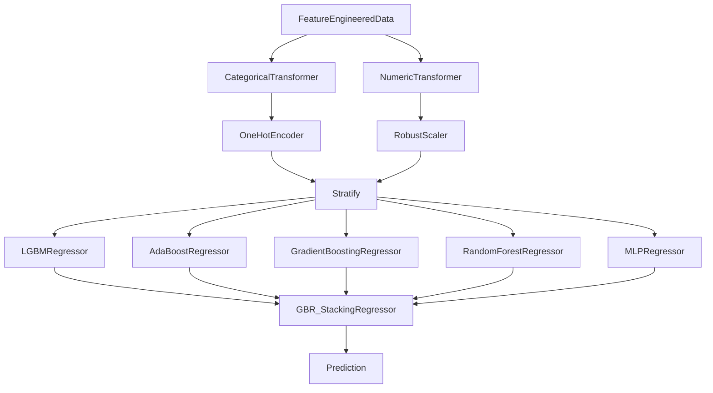

# **2011 TOUR Championship**
*Author: Declan Costello*

<!-- TABLE OF CONTENTS -->

  
Table of Contents

  <ol>
    <li><a href="#Objectives">Objectives</a></li>
    <li><a href="#Dataset">Dataset</a></li>
    <li><a href="#EDA">EDA</a></li>
    <ol>
    <li><a href="#SG-per-Round">SG per Round</a></li>
    <li><a href="#SG-per-Hole">SG per Hole</a></li>
    <li><a href="#SG-per-Drive">SG per Drive</a></li>
    </ol>
    <li><a href="#Expected-Strokes-Model">Expected Strokes Model</a></li>
    <ol>
    <li><a href="#Model-Selection">xS Model Selection</a></li>
    <li><a href="#Model-Explainability">xS Model Explainability</a></li>
    <li><a href="#Model-Arch">xS Model Arch</a></li>
    <li><a href="#Model-Preformance">xS Model Preformance</a></li>
    </ol>
    <li><a href="#SG-per-Shot">SG per Shot</a></li>
    <li><a href="#SG-per-Location">SG per Location</a></li>
    <li><a href="#Roadmap">Roadmap</a></li>
  </ol>

## **Objectives**

Welcome to my analysis of the 2011 TOUR Championship at East Lake Golf Club, the primary objective of this project is to:

> **Develop an expected strokes model to identify player preformance**

With an interest in sports analytics, I hope to contribute meaningful insights to the golf community. While the 2011 TOUR Championship occurred over a decade ago and the tournament's rules have since changed, it remains a valuable resource due to its comprehensive shot-level dataset. If you happen to come across another complete shot-level dataset, I would greatly appreciate it if you could share it with me! To delve deeper into the visual intricacies of this analysis, I encourage you to explore the interactive visuals on [NBViewer!](https://nbviewer.org/github/dec1costello/Golf/tree/main/TOUR_Championship_2011/)

## **Dataset**

Talk about the dataset and how r1+2 weaker. but not really because i dont think the field gets cut becuase its the championshp and nature of rough not nessacarly accounting for a bad lie, learn more about it from these [docs](espn.com). INcomplete dataset becuase [no playoff data](https://www.youtube.com/watch?v=vRjNR1T81VE).

## [EDA](https://nbviewer.org/github/dec1costello/Golf/blob/main/TOUR_Championship_2011/EDA.ipynb)

I explore the data and start to feature engineer to help understand, clean, and refine the dataset. It guides model choice and assumption validation, while also revealing insights through visualization. By addressing data quality and understanding patterns early, here I establish a strong foundation for the rest of my project.

### [SG per Round](https://nbviewer.org/github/dec1costello/Golf/blob/main/TOUR_Championship_2011/StrokesGainedPerRound.ipynb)

Here I explore the distribution of Strokes Gained for each round of the Championship.

#### Main Insights

* All rounds have a promising mean of 0
* Round 3 seemed to be the most chaotic, as there was a significant variance in player performance throughout the day.

  

### [SG per Hole](https://nbviewer.org/github/dec1costello/Golf/blob/main/TOUR_Championship_2011/ImprovedStrokesGainedPerRoundPerHole.ipynb)

I explore the distribution of Strokes Gained for each hole of each round of the Championship. Mahan ties Haas in SG on the 72th hole, but [Haas won in the playoffs](https://www.espn.com/golf/leaderboard?tournamentId=917)

#### Main Insights

* Player apprear to contiune to play relative to thier initial preformance of round 1
* Poorly preforming players seem to completey give up come the back 9 of round 3

  

### [SG per Drive](https://nbviewer.org/github/dec1costello/Golf/blob/main/TOUR_Championship_2011/DGvsCG.ipynb)

In Part 4, I explore the distribution of Strokes Gained vs Driving Distance Gained (DG) and Driving Accuracy Gained (AG) for each drive of the Championship. Happy to say my analysis aligns with [Data Golf's Course Fit Tool](https://datagolf.com/course-fit-tool), in that AG appears to be an important facor for preforming at East Lake Golf Club. NOTE I adjusted all drived per hole before totalling the DG

#### Main Insights

* AG has a strong correlation to SG
* DG has only a slight correlation to SG

  

(<a href="#readme-top">back to top</a>)

## Expected Strokes Model

### Model Selection

Although the training data is discrete, because we want a contious predictions I had to choose between regression models. I used Lazy Predict to intially gauge. then I tune the top 5 with [Optuna](https://optuna.org/)

#### Main Insights

* The GradientBoostingRegressor and HistGradientBoostingRegressor models preformed the best
* If I were to have to constantly retrain the model I would avoid the MLPRegressor as it has a long train time

| Model  | Adjusted R-Squared | R-Squared	| RMSE | Time Taken |
|------------|------|------------|------|------|
| GradientBoostingRegressor         | 0.85  | 0.85  | 0.46  | 0.93  |
| HistGradientBoostingRegressor     | 0.85  | 0.85     | 0.46  | 0.60  |
| LGBMRegressor                     | 0.85 | 0.85   | 0.47 | 0.14  |
| MLPRegressor                      | 0.84 | 0.84   | 0.48 | 5.23  |
| KNeighborsRegressor               | 0.82  | 0.83  | 0.50  | 0.16  |
| AdaBoostRegressor                 | 0.82  | 0.83     | 0.50  | 0.49  |
| RandomForestRegressor             | 0.82 | 0.82   | 0.85 | 0.7  |
| XGBRegressor                      | 0.82 | 0.82   | 0.85 | 0.7  |
| BaggingRegressor                  | 0.81  | 0.81  | 0.7  | 0.7  |
| NuSVR                             | 0.81  | 0.81     | 0.9  | 0.7  |
| ExtraTreesRegressor	              | 0.80 | 0.80   | 0.85 | 0.7  |
| SVR                               | 0.80 | 0.80   | 0.85 | 0.7  |

### Model Explainability

SHap for meta, Lime for based, show for putting and Approach

### [Model Arch](https://nbviewer.org/github/dec1costello/Golf/blob/main/TOUR_Championship_2011/xSG.ipynb)

In Part 5, I explore the relationship between Distance to the Pin & Lie vs Strokes to hole out at the Tour Championship. I Ensemble the top  preforming models together using a [Stack](https://scikit-learn.org/stable/modules/generated/sklearn.ensemble.StackingRegressor.html) to minimize [Bias](https://towardsdatascience.com/a-quickstart-guide-to-uprooting-model-bias-f4465c8e84bc) and [Variance](https://x.com/akshay_pachaar/status/1703757251474063861?s=20). This iterative process maximized predictive accuracy of Expected Strokes(xS)

### [xS Model Preformance](https://nbviewer.org/github/dec1costello/Golf/blob/main/TOUR_Championship_2011/DGvsCG.ipynb)

These charts help evaluate the model by showing how predicted values compare to actual ones and revealing patterns in prediction errors. The "Predicted vs Actual" chart checks overall accuracy, while the "Predicted vs Residual" chart highlights patterns in errors. The histogram in "Normality of Residuals" assesses if errors follow a normal distribution, crucial for reliable predictions. NOTE - compare sum of model to true by hole see discreps

  

(<a href="#readme-top">back to top</a>)

## Applying xS Model

### [SG per Shot](https://nbviewer.org/github/dec1costello/Golf/blob/main/TOUR_Championship_2011/DGvsCG.ipynb)

Now that we have a reliable model, we can use it to identify a player's strengths and weaknesses by subtracting Expected Strokes (xS) from the result of each shot to give us true Strokes Gained (SG). This plot displays Baddeley's SG by shot type, providing a clear visualization of his performance across different lies and distances.

  

(<a href="#readme-top">back to top</a>)

<!-- ROADMAP -->
## Roadmap

- [x] xS Stack Model Refinement
    - [x] Create seperate putting model
    - [ ] MLFlow
        - [ ] [Refer To](https://medium.com/infer-qwak/building-an-end-to-end-mlops-pipeline-with-open-source-tools-d8bacbf4184f)
        - [ ] [Watch](https://www.youtube.com/watch?v=-7XegzgjgM0&list=PLQqR_3C2fhUUkoXAcomOxcvfPwRn90U-g&index=8)
        - [ ] [Utilize](https://community.cloud.databricks.com/?o=5379878152283690)  
    - [ ] Drift Detection
        - [ ] [Evidently](https://www.youtube.com/watch?v=L4Pv6ExBQPM)
        - [ ] [Whylogs](https://github.com/whylabs/whylogs)
- [ ] Add External Data
    - [ ] [Career Earnings](https://www.spotrac.com/pga/rankings/date/2011-01-01/2011-09-20/)
    - [ ] Biometrics
    - [ ] [Weather](https://www.wunderground.com/history/daily/KATL/date/2011-9-22)
- [ ] Data Viz
    - [ ] [SG Distributions](https://baseballsavant.mlb.com/visuals/statcast-pitch-distribution)
    - [ ] [Hole Heatmaps](https://datagolf.com/hole-heatmaps)
    - [ ] [Lie & SG Plinko](https://baseballsavant.mlb.com/visuals/pitch-plinko)
    - [ ] [Drive KDE](https://baseballsavant.mlb.com/player-comparison)
- [ ] Bayesian Integration
    - [ ] [Refer To](https://colab.research.google.com/github/AllenDowney/ThinkBayes2/blob/master/examples/hockey.ipynb#scrollTo=B-c6bb9wO-Cs)
    - [ ] [Watch](https://www.youtube.com/watch?v=Zi6N3GLUJmw)
    - [ ] [Utilize](https://colab.research.google.com/github/AllenDowney/ThinkBayes2/)
- [ ] Dockerize & Deploy

(<a href="#readme-top">back to top</a>)

